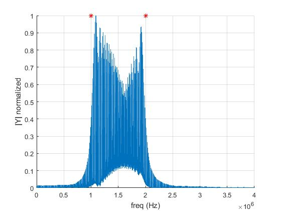
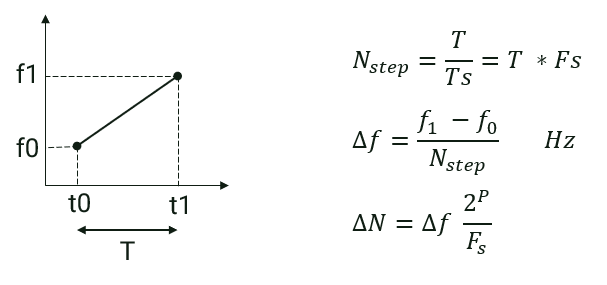

# DDS
Direct digital synthesis module implemented in VHDL language.
Look up table values generated in MATLAB and saved in a file.

In DDS Module look up table values read from file and look up table defined as an array in VHDL.
Phase increment input first registerd and then added to phase accumulator register in each register.

In test bench sine waves with different frequencies generated, output of DDS module wrote in a file and the output plotted in time domain, frequency domain and time-frequency domain in MATLAB.

In "tb_dds_chirp.vhd" Phase increment input changed in each clock to generate Chirp Pulse with implemented DDS module.

Chirp pulse test bench results:

in frequency domain:

